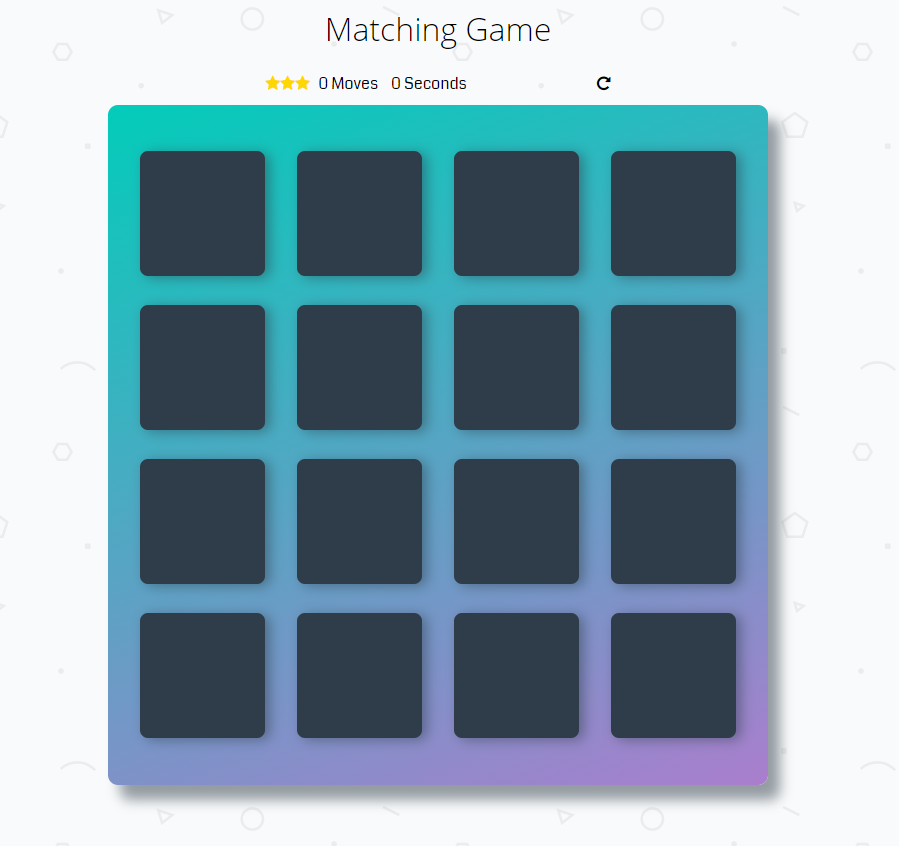

# Memory Game Project

A Classic Memory Game.

LIVE PREVIEW => **[https://ahmedelaguab.github.io/memory-game/](https://ahmedelaguab.github.io/memory-game/).**

## Getting Started

To start playing this game, you have to either download or clone it to your machine.

```
git clone http://www.github.com/AhmedELaguab/memory-game
```


## How the Game Works

The game board consists of sixteen "cards" arranged in a grid. The deck is made up of eight different pairs of cards, each with different symbols on one side. The cards are arranged randomly on the grid with the symbol face down. The gameplay rules are very simple: flip over two hidden cards at a time to locate the ones that match!


## How to play

* The player flips one card over to reveal its underlying symbol.
* The player then turns over a second card, trying to find the corresponding card with the same symbol.
* If the cards match, both cards stay flipped over.
* If the cards do not match, both cards are flipped face down.

The game ends once all cards have been correctly matched.


## Screenshots




## Built With

* HTML/HTML5
* CSS/CSS3
* Pure JavaScript


## Contributing

This repository is my code to pass the second Project of Udacity Front-End Developer Nanodegree Program. Therefore, I most likely will not accept pull requests.

For details, check out [CONTRIBUTING.md](CONTRIBUTING.md).
